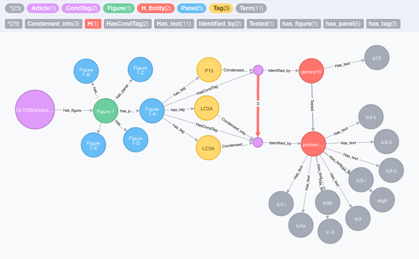

# sd-graph
[Source Data](http://sourcedata.embo.org) is a platform built by [EMBO](embo.org) in collaboration with [Vital-IT](https://www.vital-it.ch/) to make papers and datasets discoverable based on the experiments show in figures.

When refering to SourceData, please cite the following preprint:

> __SourceData - a semantic platform for curating and searching figures.__  
> Robin Liechti, Nancy George, Sara El-Gebali, Lou Götz, Isaac Crespo, Ioannis Xenarios, Thomas Lemberger.  
> _BioRxiv_  (2016), doi: https://doi.org/10.1101/058529  

We provide here instructions to build the SourceData sd-graph database in [neo4j](http://neo4j.com) and examples of analyses:

Install the neo4j database according to the instructions provided at http://neo4j.com
Note: these scripts were tested under neo4j 2.2.

Install the [Neo4j Python REST Client](https://pypi.python.org/pypi/neo4jrestclient/) with

    pip install neo4jrestclient
    
or

	easy_install neo4jrestclient 

To download the content of the SourceData database through the SourceData API and populate the neo4j database, run this command:

    python sdneo.py --password <your_password_to_your_neo4j_instance> PUBLICSEARCH
  
Next, build the relationships to create the sd-graph model:

    neo4j-shell -file SD-constraints.cql
    neo4j-shell -file SD-processing.cql

This will create the following model:

 

Now, we need to create a protein to gene mapping. First, go in the neo4j client in your browser and run this CYPHER command:

    MATCH (t:Tag)
    WHERE t.type = "protein" AND t.ext_id <> ""
    WITH split(t.ext_id,"///") AS ids
    UNWIND ids as id
    RETURN DISTINCT id

Save the results as csv to a `export.csv` file. Go to http://www.uniprot.org/uploadlists/ and generate a `UniProtKB AC/ID` to `GeneID (Entrez Gene)` mapping `protein2gene.tab` file.

Update `SD-protein2gene.cql` with the absolute path of the `protein2gene.tab` file and build the protein-to-gene mapping with

    neo4j-shell -file SD-protein2gene.cql
 
Et voilà!

The database is now ready and the examples provided in SD-scripts can then be run directly in the neo4j client.
